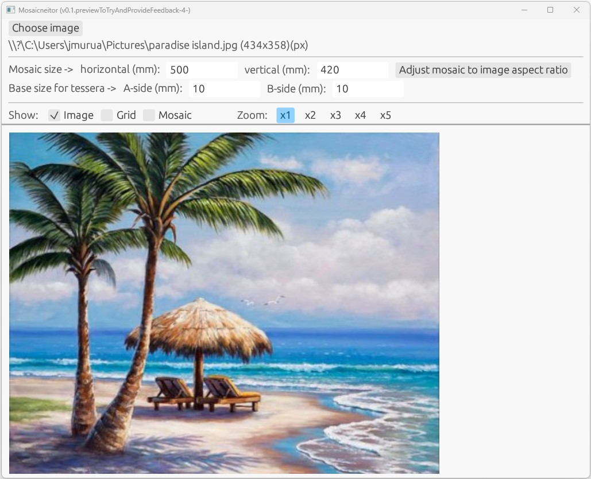
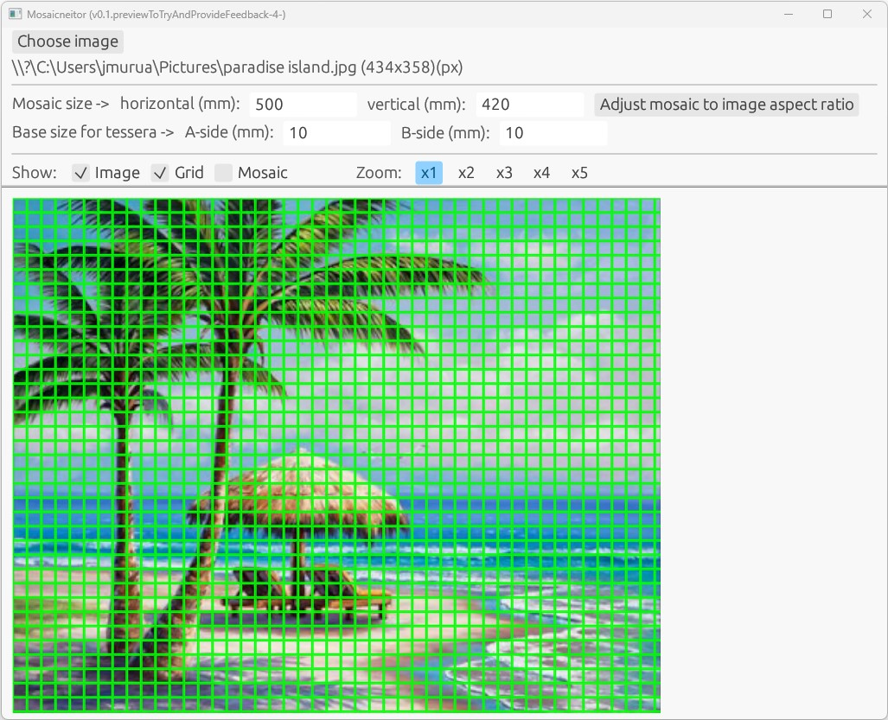
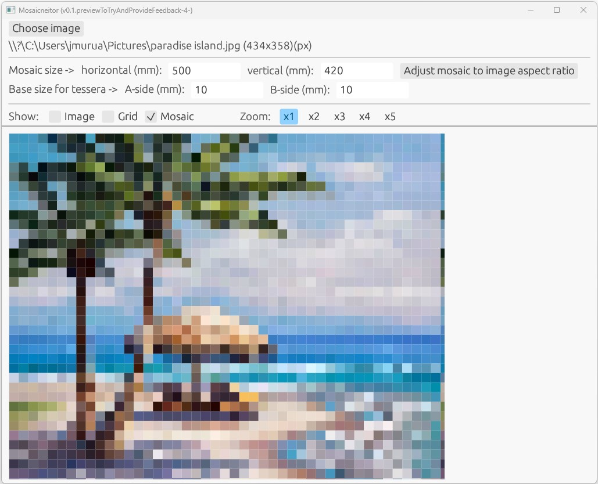

# mosaicneitor

To plan the placement of tesserae, starting with an image you want to make a mosaic for.

## Important!

(November 2024) I just realized that the tessellation process is not as simple as I contemplated at first glance. It is not about a regular rectangular grid. The "liveness" of a mosaic reside into its "expression lines". Curved lines in strategic places...

Much more difficult to program!
